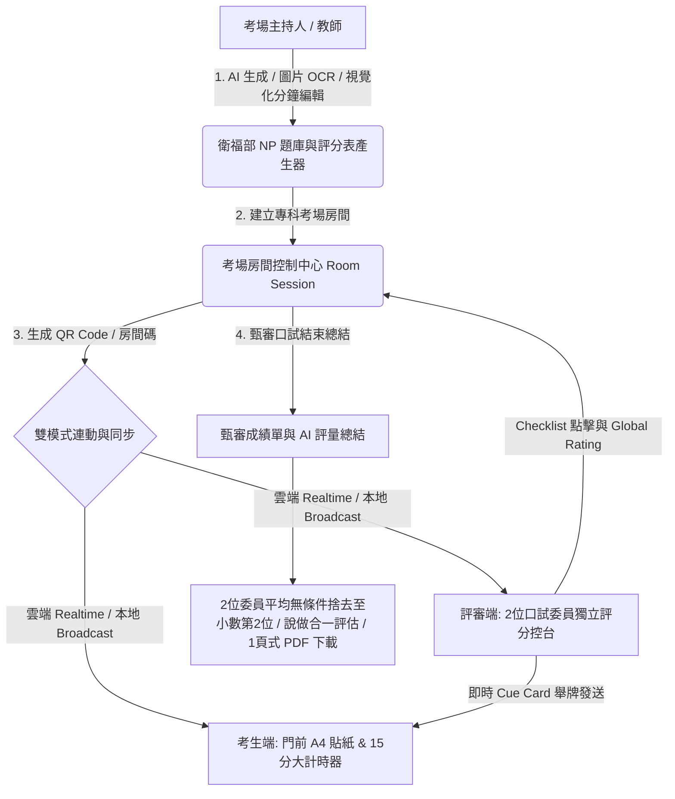

# 衛生福利部專科護理師 (NP) 甄審口試與 OSCE 題庫評分表產生器 實作計畫

本專案旨在建立一個專為 **「衛生福利部 專科護理師 (Nurse Practitioner, NP) 甄審口試」** 設計的高質感、跨裝置實時連動 PWA 系統。系統完全對齊 **《110 年度專科護理師甄審口試流程及評分方式公告》** 官方公文簡章規範，涵蓋「專科分科 AI/圖片 OCR 題庫產生器」、「門前極簡 A4 試題貼紙」、「15分鐘與前2分鐘廣播計時器」、「2位口試委員現場評分」與「無條件捨去至小數點第2位之成績單與 AI 評量總結」。

---

## 核心架構與官方規範對齊

---

## 關鍵規範與功能實作細節

### 1. 衛生福利部專科護理師甄審口試 官方規範對齊
- **預設專科分科**：以 **「外科專科護理師 (Surgical NP)」** 為預設首選，並支援內科、兒科、婦產科、精神科與麻醉科分科。
- **全場 15 分鐘規範**：倒數計時器預設為 **15:00**（**前 2 分鐘為門前閱讀**，**後 13 分鐘為考間口試**）。
- **結束前 2 分鐘廣播提醒**：當時間倒數至 **13:00 / 02:00** 時，系統自動觸發紅色醒目廣播 Banner 與語音提醒：`📢 【廣播提醒】距離口試結束剩餘 2 分鐘！`
- **「說做合一」考評標準**：考核 NP 考生在執行身體健康評估時，**必須同時向病人說明檢查目的、項目及部位**。
- **2 位口試委員成績計算**：
  $$\text{甄審實得成績} = \lfloor \frac{\text{委員 A 得分} + \text{委員 B 得分}}{2} \times 100 \rfloor / 100$$
  成績計算至小數第 2 位（第 3 位無條件捨去），**及格標準精準設為 60.00 分**。

---

### 2. 門前極簡 A4 試題貼紙 (Door Station Sheet Card)
應國考實況需求，考生端呈現高對比度擬真 A4 門口貼紙，僅顯示精簡欄位：
- **【病人基本資料與主訴】**（如：65歲男性 PPU 術後第1天，腹痛、呼吸喘）
- **【VITAL SIGNS 生命徵象】**（T: 37.8°C | O2 3L SpO2: 92-94% | HR: 108 | RR: 26 | BP: 135/85）
- **【衛福部甄審應考須知】**（一句話簡單提示任務）

---

### 3. 直覺式「分鐘選擇器 (Minute Selectors)」題庫編輯器
- 全面摒棄不直覺的秒數輸入框，改用下拉選單：
  - **門前閱讀時間**：`2 分鐘 (衛福部國考門前標準)`
  - **考間口試作答時間**：`13 分鐘 (衛福部甄審口試標準)`
  - **換場講評時間**：`2 分鐘 (標準講評)`
- 頂部呈現動態總計標籤：`甄審總計：15 分鐘`。

---

### 4. 經典真題教案庫 (Pre-set NP Stations)
- **【經典真題】65歲男性 PPU (消化性潰瘍穿孔) 術後第1天腹痛與呼吸喘**：
  - **LQQOPERA 病史**：肚子悶脹痛、嘔吐、尿少。
  - **個人/家族史**：飲食偏辣外食、高血壓/糖尿病/抽菸30年、母糖尿病。
  - **身體評估 Cue Cards**：雙側濕囉音、聽診無腸音、CWV 引流液顏色混濁、傷口無紅腫痛。
- **【內科真題】急性胸痛與心肺功能衰竭評估與 SBAR 溝通**。

---

## 技術棧與組件維護

| 模組 | 採用技術與檔案位置 |
| :--- | :--- |
| **全站預設名稱與品牌** | [index.html](file:///i:/project/OSCE_training/index.html) (`衛福部專科護理師甄審口試`) |
| **頁首與身分權限** | [Navbar.jsx](file:///i:/project/OSCE_training/src/components/Navbar.jsx) (`衛福部專科護理師甄審專用`, `口試委員`) |
| **題庫與分鐘產生器** | [StationGenerator.jsx](file:///i:/project/OSCE_training/src/components/generator/StationGenerator.jsx) (專科分科選單、分鐘選擇器) |
| **門前 A4 貼紙與大計時器** | [CandidateView.jsx](file:///i:/project/OSCE_training/src/components/candidate/CandidateView.jsx) (15分計時、2分廣播、門前貼紙) |
| **2位口試委員控台** | [ExaminerView.jsx](file:///i:/project/OSCE_training/src/components/examiner/ExaminerView.jsx) (口試委員 A/B 評分、Cue Card 一鍵舉牌) |
| **成績單與 AI 總結** | [ExamReportView.jsx](file:///i:/project/OSCE_training/src/components/report/ExamReportView.jsx) (2位委員平均無條件捨去、及格 60.00分) |
| **AI 服務與提示** | [aiService.js](file:///i:/project/OSCE_training/src/services/aiService.js) (Gemini 2.5 衛福部 NP 甄審專用提示) |
| **國考經典教案庫** | [mockData.js](file:///i:/project/OSCE_training/src/store/mockData.js) (65歲 PPU 術後經典真題) |

---

## 驗證結果

1. **系統編譯**：執行 `npm run build` 打包完全無錯誤。
2. **時間與廣播**：大計時器顯示 15:00，倒數至剩餘 2 分鐘時準時彈出紅底廣播通知並響鈴。
3. **成績算式**：評分結果精準依 `Math.floor( (A+B)/2 * 100 ) / 100` 計算，顯示至小數點後兩位（如 `70.00 / 100`）。
4. **介面視覺**：通過極簡 A4 門前貼紙與 2 欄式視覺化編輯器驗證。
